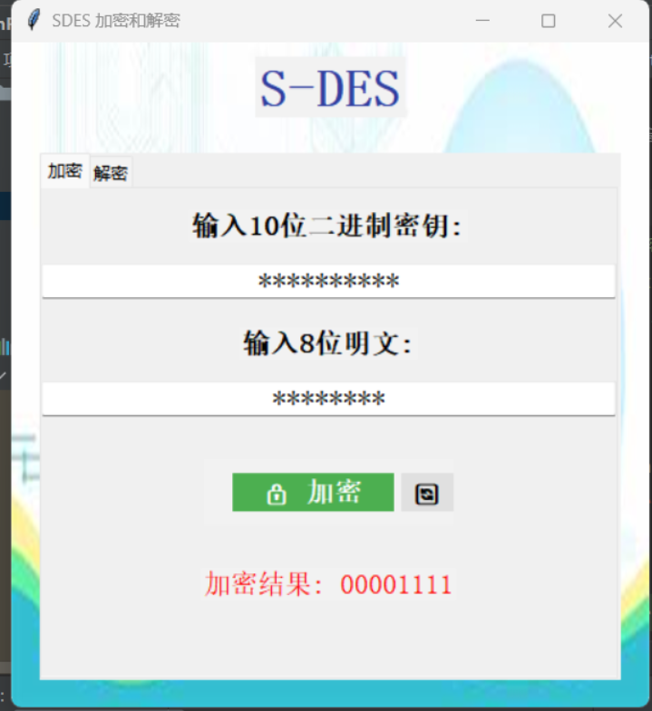
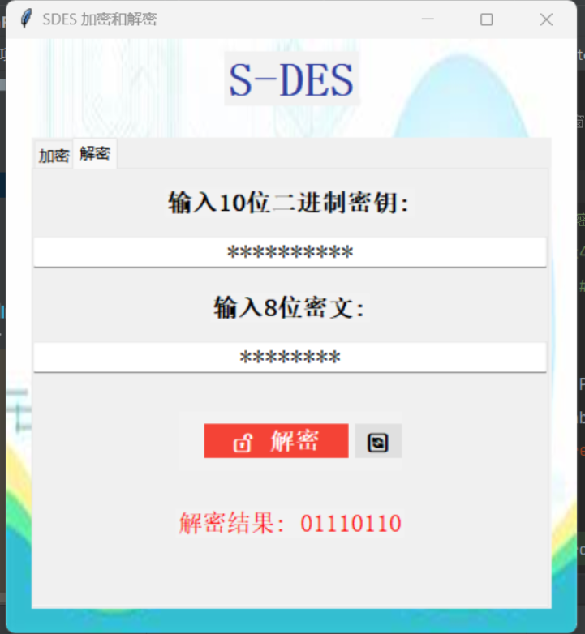

# 关卡测试情况：

## 第一关 - 基本测试

​       根据S-DES算法编写和调试程序，提供GUI解密支持用户交互。输入可以是8bit的数据和10bit的密钥，输出是8bit的密文。

**加密测试：**

- 输入明文：11111110
- 输入密钥：1111111110
- 得到结果：10011111


**解密测试：**

- 输入密文：10011111

- 输入密钥：1111111110

- 得到结果：11111110

  


**特殊输入：**

输入密文 不符合8位2进制


解密失败。


加密失败。

## 第二关-交叉测试

明文：11111111

密钥：1111111111

**本组加密结果：**


石子伯组加密结果：



测试成功。

解密：

密文：11111110

密钥：1111111111

**我们组测试情况**：


其他组测试情况：



## 第三关-拓展功能

考虑到向实用性扩展，加密算法的数据输入可以是ASCII编码字符串(分组为1 Byte)，对应地输出也可以是ASCII字符串(很可能是乱码)。

ASCII加密：

明文：hello

密钥：1010101010

结果：


ASCII解密：

明文：hello

密钥：1010101010

结果：


## **第四关-暴力破解**

假设你找到了使用相同密钥的明、密文对(一个或多个)，请尝试使用暴力破解的方法找到正确的密钥Key。在编写程序时，你也可以考虑使用多线程的方式提升破解的效率。请设定时间戳，用视频或动图展示你在多长时间内完成了暴力破解。

我们采用两种方案：

**方案一**：


**暴力破解分析**：通过生成随机的明文和密钥对，使用暴力破解算法来测试从密文中推导出密钥所需的时间。该功能使用多线程优化了暴力破解的性能，并通过实验验证不同明文-密钥对的破解时间。

- **暴力破解流程**：
  1. `brute_force_key` 函数用于通过暴力搜索找到一个加密密钥。它的工作原理是依次生成所有可能的10-bit二进制密钥（从`0000000000`到`1111111111`，即0到1023），并通过加密明文来与给定的密文进行比对。
  2. 一旦找到了匹配的密钥，就会立即停止搜索，并返回找到的密钥和所花费的时间。
- **多线程处理**：
  1. 函数将整个搜索空间（1024个可能的密钥）分为4个部分，每个部分由一个线程处理。每个线程独立地尝试一组密钥，并使用 `encrypt_text` 函数对明文加密后与密文进行比对。
  2. 每个线程负责的密钥区间由 `step` 参数决定，`1024 // num_threads` 的结果为 256，所以每个线程检查256个可能的密钥。
  3. 一旦其中一个线程找到了匹配密钥，它会将结果存储到 `result` 中。
- **性能监控**：
  - `start_time` 和 `end_time` 记录了整个暴力破解的时间，如果找到匹配的密钥，则返回密钥和破解时间。
  - 通过多线程提高了搜索速度，但并不是完美的并行化（因为线程之间没有共享工作负载的动态平衡）。


## **第五关-封闭测试**

根据第4关的结果，进一步分析，对于你随机选择的一个明密文对，是不是有不止一个密钥Key？进一步扩展，对应明文空间任意给定的明文分组P<sub>n</sub>，是否会出现选择不同的密钥K<sub>i</sub>&ne;K<sub>j</sub>加密得到相同密文C<sub>n</sub>的情况？

**明密文对密钥唯一性分析**：

对于用户随机选择的明密文对，我们仅需遍历所有密钥，找出所有密文相同的密钥。我们调用`brute_force.py`里的`brute_force_attack`函数，输出所有满足条件的密钥。

```python
def brute_force_attack(plaintext, ciphertext):
    matching_keys = []
    for i in range(1024):
        key_candidate = [int(b) for b in f"{i:010b}"]
        K1, K2 = key_generation(key_candidate)
        enc = encrypt(plaintext, K1, K2)
        if enc == ciphertext:
            matching_keys.append(''.join(str(b) for b in key_candidate))
    return matching_keys if matching_keys else "未找到密钥"
```

用户分别输入明文密文：

```python
请输入8位已知明文: 10111111

请输入8位已知密文: 11111111
```

 得到如下结果：

```python
找到的密钥: ['0001000110', '0011110010']
```

分析得知，对于随机一个明密文对，并非只有一个密钥key，可能会出现多个密钥的情况。

**明文组相同密文分析**：

对于对应明文空间任意给定的明文分组，我们只需要将明文经过所有的密钥加密后得到对应的密文，找出相同的密文，并输出此密钥-密文对。在这里我们运行`identical_ciphertext.py`，其中`analyze_identical_ciphertexts_for_plaintexts`函数完成查找输出的任务。

```python
def analyze_identical_ciphertexts_for_plaintexts(plaintexts):
    """
    对用户输入的多个明文，使用所有可能的密钥进行加密，并找出那些使得所有明文加密后得到相同密文的密钥。

    参数：
        plaintexts (list of list): 多个明文的位列表

    输出：
        打印出所有使得所有明文加密后得到相同密文的密钥和对应的密文。
        如果没有找到符合条件的密钥，打印一个说明消息。
    """
    # 存储每个密钥加密每个明文后生成的密文
    key_to_ciphertext_map = {}

    # 遍历所有可能的密钥
    for i in range(1024):
        key_candidate = [int(b) for b in f"{i:010b}"]
        K1, K2 = key_generation(key_candidate)
        # 检查当前密钥加密每个明文是否产生相同的密文
        common_ciphertext = None
        is_common = True
        for plaintext in plaintexts:
            ciphertext = encrypt(plaintext, K1, K2)
            ciphertext_str = bit_list_to_str(ciphertext)
            if common_ciphertext is None:
                common_ciphertext = ciphertext_str
            elif common_ciphertext != ciphertext_str:
                is_common = False
                break
        
        if is_common:
            # 如果该密钥对所有明文产生了相同的密文，则记录
            key_to_ciphertext_map[common_ciphertext] = key_to_ciphertext_map.get(common_ciphertext, []) + [bit_list_to_str(key_candidate)]

    # 打印找到的密钥和对应的相同密文
    if key_to_ciphertext_map:
        for ciphertext, keys in key_to_ciphertext_map.items():
            print(f"密文 {ciphertext}\n有密钥 {'、'.join(keys)}\n")
    else:
        # 如果没有找到任何使得所有明文加密后密文相同的密钥
        print("没有找到任何密钥使得所有输入的明文加密后得到相同的密文。")
```

用户输入明文组数量并分别输入明文：

```python
请选择操作：
1. 分析一组明文相同密文的密钥
2. 退出
请输入选项(1/2): 1
请输入明文的数量: 1
请输入第 1 个8位明文: 11111111
```

得到如下结果（省略部分）：

```python
密文 10101111
有密钥 0101000011、0110111000、0111010111、1010110010、1011111010

密文 00001010
有密钥 0101000111

密文 10100001
有密钥 0101010000、1000011010、1001010010

密文 01000100
有密钥 0101010100、0110011011

密文 11000101
有密钥 0101010101、0111100001

...

密文 10000111
有密钥 0101010111、1000010111、1001011111
```

所以，对于已知的明文分组，存在不同的密钥使其密文相同的情况。

# **文档**

本手册提供了关于 Vue3 项目中实现的加密/解密功能的详细说明和使用指南。该项目使用 Vue3 前端框架和 Python 后端服务，支持二进制和字符串的加密/解密操作，并提供暴力破解分析功能。

---

## **环境配置**

- **操作系统**: Windows
- **前端框架**: Vue 3
- **后端语言**: Python 3.8+
- **依赖库**:
  - `axios`: 用于前后端通信
  - `Element Plus`: 用于 UI 组件
  - `Flask`: 用于后端服务
  - `numpy`, `matplotlib`, `scipy`: 用于后端数据处理和分析

---

## **安装步骤**

1. **克隆项目代码**:
   ```bash
   git clone <项目的 Git 仓库链接>
   ```

2. **进入项目目录，安装前端依赖**:
   ```bash
   cd sdes
   npm install
   ```

3. **安装后端依赖**:
   ```bash
   pip install -r requirements.txt
   ```


代码结构

项目代码结构如下:

```markdown
├── my-vue3-project
│  ├── src
│  │  ├── views
│  │  │  ├── AppLogin.vue
│  │  │  └── Dashboard.vue
│  │  ├── router
│  │  │  └── index.js
│  │  ├── main.js
│  │  ├── App.vue
│  │  └── style.css
│  ├── backpy.py
│  ├── brute_force.py
│  ├── identical_ciphertext.py
│  ├── index.html
│  ├── package.json
│  └── package-lock.json
```


## **模块说明**

#### **前端部分**

- **`AppLogin.vue`**:
  - 实现用户登录界面，提供二进制和字符串的加密/解密功能。
  - 使用 `axios` 进行 HTTP 请求，与后端交互。
  - 提供暴力破解分析功能，展示分析结果。
- **`router/index.js`**:
  - 定义应用的路由配置，管理页面导航。
- **`main.js`**:
  - 应用的入口文件，初始化 Vue 实例。
- **`style.css`**:
  - 定义全局样式，确保应用的一致性。

#### **后端部分**

- `bakcpy.py`

  - 实现后端服务，处理加密/解密请求。
- 使用 Flask 框架，定义路由处理请求。
  - 提供加密、解密和暴力破解分析功能。

- `brute_force.py`

  - 接收用户输入的明文和密文。
  - 分析将明文加密为特定密文的所有密钥并输出。
  
- `identical_ciphertext.py`

  - 接收用户输入的明文组。

  - 遍历所有可能的1024个密钥并加密。

  - 分析是否存在密钥可以使明文加密后产生相同的密文。

    ****

## **功能说明**

#### **加密/解密功能**

- 用户输入明文和密钥，选择加密或解密操作。
- 前端通过 `axios` 发送请求到后端，后端返回处理结果。

#### **暴力破解分析**

- 用户输入明文和密文，触发暴力破解分析。
- 后端返回可能的密钥和分析时间，前端展示结果。

#### 封闭测试分析

- 用户按要求输入明密文，具体分析密钥情况。
- 后端返回所有的结果。

#### **数据可视化**

- 使用 `matplotlib` 生成分析图表，前端通过 `` 标签展示。

****


## **与后端交互**

- 使用 `axios` 实现与 Flask 后端的交互，动态更新响应信息，提供友好体验。


****

## **数据格式处理**

- 前端将用户输入的数据格式化为 JSON，发送到后端。
- 后端解析数据，进行相应的加密/解密操作，结果以 JSON 格式返回前端。


## 接口文档

以下是接口文档的格式化版本：

---

### **接口文档**

#### **前端接口**

1. **二进制加密**
   - **URL**: `/binary_encrypt`
   - **方法**: `POST`
   - **请求参数**:
     - `text`: 8位二进制明文
     - `key`: 10位二进制密钥
   - **响应**:
     - `result`: 加密后的密文

2. **二进制解密**
   - **URL**: `/binary_decrypt`
   - **方法**: `POST`
   - **请求参数**:
     - `text`: 8位二进制密文
     - `key`: 10位二进制密钥
   - **响应**:
     - `result`: 解密后的明文

3. **字符串加密**
   - **URL**: `/string_encrypt`
   - **方法**: `POST`
   - **请求参数**:
     - `text`: 字符串明文
     - `key`: 10位二进制密钥
   - **响应**:
     - `result`: 加密后的密文

4. **字符串解密**
   - **URL**: `/string_decrypt`
   - **方法**: `POST`
   - **请求参数**:
     - `text`: 字符串密文
     - `key`: 10位二进制密钥
   - **响应**:
     - `result`: 解密后的明文

5. **暴力破解分析**
   - **URL**: `/brute_force_analysis`
   - **方法**: `GET`
   - **响应**:
     - `plot`: Base64编码的分析图像

---

#### **后端接口**

- **Flask 路由设置**:
  - `@app.route('/binary_encrypt', methods=['POST'])`: 处理二进制加密请求
  - `@app.route('/binary_decrypt', methods=['POST'])`: 处理二进制解密请求
  - `@app.route('/string_encrypt', methods=['POST'])`: 处理字符串加密请求
  - `@app.route('/string_decrypt', methods=['POST'])`: 处理字符串解密请求
  - `@app.route('/brute_force_analysis', methods=['GET'])`: 处理暴力破解分析请求

---

### **组件说明**

#### **前端组件**

- **`AppLogin.vue`**:
  - 提供用户登录界面，支持二进制和字符串的加密/解密操作。
  - 使用 `axios` 进行 HTTP 请求，与后端交互。
  - 提供暴力破解分析功能，展示分析结果。

- **`Dashboard.vue`**:
  - 提供用户的仪表盘界面，展示用户信息和操作记录。

- **`router/index.js`**:
  - 定义应用的路由配置，管理页面导航。

- **`main.js`**:
  - 应用的入口文件，初始化 Vue 实例。

- **`style.css`**:
  - 定义全局样式，确保应用的一致性。

#### **后端组件**

- **`backpy.py`**:
  - 实现后端服务，处理加密/解密请求。
  - 使用 Flask 框架，定义路由处理请求。
  - 提供加密、解密和暴力破解分析功能。

---

### **数据格式**

- **请求格式**:
  - `JSON` 格式，包含必要的参数如 `text` 和 `key`。

- **响应格式**:
  - `JSON` 格式，包含结果数据如 `result` 或 `plot`。

---


